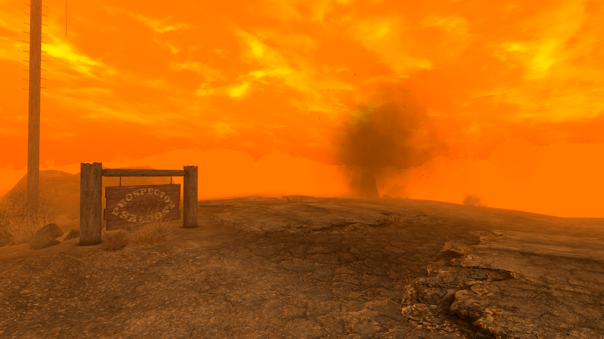

A modlist that attempts to recreate the Dust experience in the vanilla New Vegas gameworld, while adding tweaks that improve New Vegas itself.

### [Download](https://github.com/Biblioklept/hyperessentials/releases/latest)

Additional work you may want to do:

 

- **Run the Ultimate Edition ESM Fixes installer.** The Ultimate Edition ESM Fixes installer requires administrator permissions, so you'll need to open the mod folder and go to build to run the installer, as it isnt recommended to run MO2 in administrator unless absolutely necessary.

Gameplay Guide:

 

- This modlist will try and screw you over in all the possible ways it can, in the spirit of DUST, however everything should die relatively quickly.
- The weather mod being used will set in after a minute or two, after that it will stay that way for the rest of the game, because of this weather, it will be difficult to see far away enemies.
- You will need to learn to manage everything properly, ammo and meds will be scarce, and equipment will be low condition.
- Hardcore is enabled by default for the true "Dust"-esque experience, you will need to eat, drink, and sleep, to survive.
- Unlike DUST, there is no system for sanity, you do not have to worry about it. (This might change if I actually create a mod pulling the sanity system out of DUST (with improvements).

Troubleshooting:

 

No problems as of now!

Notes:

 

- New Vegas' AI will still be able to see you through the weather mod. I will see if I can fix this personally.

Changelog:

 

__Update 1.0.0:__
- Inital release.

